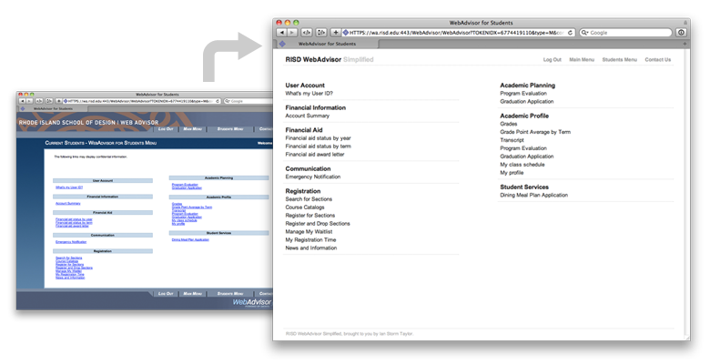

# WebAdvisor Simplified

As designers we are con­stantly both­ered by all of the poorly designed things around us. We can whine about the worst offenders to friends, but by now they've learned to filter our com­plaints. It's a tough life.

If you aren't a RISD stu­dent you can con­sider your­self lucky to never have had to deal with WebAdvisor, and I apol­o­gize for the exclu­sive target audi­ence of this post, but some­thing had to be done.

I've cre­ated Safari and Chrome exten­sions to sim­plify the WebAdvisor inter­face. While the pieces them­selves are unchanged, their appear­ance has been dras­ti­cally simplified—no more faux small-caps, minus­cule type, or unnec­es­sary junk. With the horrid inter­face gone, now all of your focus can be on clearing your cookies.

You can download the [Chrome extension](http://v5.ianstormtaylor.com/experiments/WebAdvisorSimplified/WebAdvisorSimplified.crx) or the [Safari Extension](http://v5.ianstormtaylor.com/experiments/WebAdvisorSimplified/WebAdvisorSimplified.safariextz).

To install these exten­sions you need to be using the latest ver­sion of [Safari](http://www.apple.com/safari/) or [Chrome](http://www.google.com/chrome/)—which you should be using any­ways you fool... they are free.