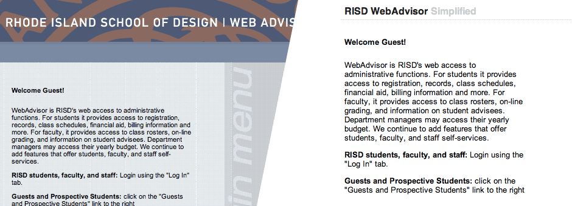
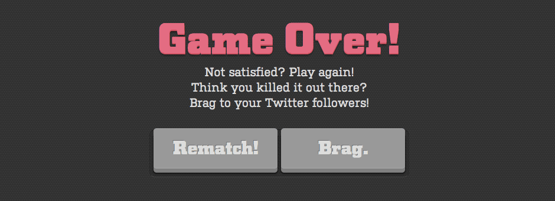
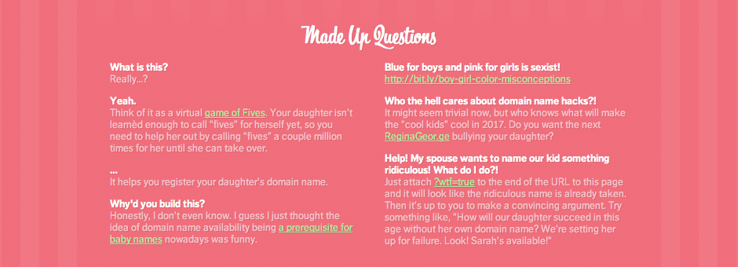

# Audience on the Web

There's no question that audience is an important consideration in design. Hell, it isn't even design if there isn't an audience. But the web has transformed that audience from a passive group into a powerful one. It has tilted the balance of power back in favor of the user. Be it through [entertaining ad campaigns going viral](http://www.reddit.com/r/entertainment/comments/cp190/the_old_spice_man_responds_to_the_internet/), through [companies depending on "super users" to moderate their content](http://techcrunch.com/2010/11/25/stack-overflow-hits-10m-uniques-boldly-goes-where-no-qa-site-has-gone-before/), through [small startups taking on big companies and winning market share](http://techcrunch.com/2010/07/25/fawlty-logic/), through [large groups of anonymous users taking down big corporations' websites](http://news.cnet.com/8301-13578_3-20024701-38.html?tag=mncol;txt), or through [twitter beating news outlets to release breaking news](http://news.cnet.com/8301-31001_3-20058782-261.html#ixzz1LArs5JOf), the internet has showed us that users aren't to be taken lightly.

Users have gotten used to that power too. The more advanced a user, the less accommodating they will be of a poor experience. When someone gets bored waiting for your website to load or gets frustrated when your form doesn't remember their information, you don't get a second chance to make things right. You lose them. [Jakob Nielsen](http://www.useit.com/) has proved [time](http://www.useit.com/alertbox/9703a.html) and [time again](http://www.useit.com/alertbox/response-times.html) that even a 1-second delay has a big effect on an experience. And after a 10-second delay, it's a miracle if the user hasn't opened a new tab already.

This increased power is most evident in my own work on [WebAdvisor Simplified](http://ian.st/webadvisor), a browser extension that cleans up the WebAdvisor interface. Since I'm a designer/developer, I have even more ability to react to things as I speak the web's language. When I wasn't happy (read: disgusted) with the enterprise (read: straight-out-of-the-90s) interface we use to register for classes at RISD, I decided to create an extension that gave it a new look. From there it was easy to post a link to the extension on Facebook, and what was a one-day project gained traction pretty quickly.

<small>The WedAdvisor interface before and after my extension.</small>

Which brings up another important point: not only will users ditch websites they aren't happy with, they'll make sure all their friends know they left too. After all, the internet makes telling everyone you know (and more you don't) incredibly easy.

<ul class="tweets"></ul>
<small>Four recent _real_ tweets containing "microsoft #fail" that will _hopefully_ prove that point.</small>

It doesn't even matter if your product isn't on the web. Your users are, so you'll have to be. Big corporations have been forced, at the mercy of their users, to become "social" to stay in the game. But even then, users' bullshit meters on the web are extremely sensitive. The web is bullshit-averse, so you need to be real with your audience if you want to succeed.  Companies that try to cut too many corners get called out quickly. People aren't looking for a parent or a big brother, they want their brands to be their peers, and to do that, brands have to operate on the user's level. This is one area startups tend to get right because they're designing products they'd [want to use themselves](http://paulgraham.com/organic.html).

[Matchuppps](http://ian.st/matchuppps), a game I built for the [10k Apart contest](http://10k.aneventapart.com/), is an example of finding the appropriate tone. When the game finishes, the user is prompted to "Brag." I could have called it "Share you score on twitter", but that sounds lame, so people would be less inclined to act. Instead, I realized that they had just finished a two-minute race against the clock to match up images, and if they did get a good score, bragging is exactly what they'd want to do. It was about keeping the language casual and appropriate to its context.

<small>The brag screen at the end of a game of Matchuppps.</small>

Those challenges are especially significant for startups on the web—an area I will be entering very soon since I just joined one as a co-founder. As a startup, you're often trying to sell a product that no one knows they need yet. In our case, we're a bit better off in that were building new solutions to problems that already exist, but the challenges remain. If the interface doesn't make sense right away, why should the user waste their time trying to figure it out when they're happy with the status quo?

As a designer on the web, to create "good" experiences, I need to be able to empathize with the intended audience. I need to discover and then give the audience what they want (which, as [Tom Preston-Werner]( http://tom.preston-werner.com/), Co-founder of Github, [points out](http://tom.preston-werner.com/2011/03/29/ten-lessons-from-githubs-first-year.html), isn't always what they ask for). Everything needs to be considered, from the big picture ideas like how a user accesses the product, to smaller picture decisions like which and how many features to highlight on a products homepage, to the [finest details](http://littlebigdetails.com) like the degree of rotation that a Refresh arrow should have to best communicate its function.

When I made [Babysquatter](http://babysquatter.com), a web app targeted at parents looking for a domain name for their babies, I created it with the little things in mind. In fact, seeing as it was a pretty ridiculous project, a main reason for me building it was to have fun with the details. I took it as an opportunity to embed lots of subtle interactions into the experience. The list includes: remembering the user's gender choice from their last visit, changing the favicon and page title when changing gender (as well as iOS icon if your on the iPhone), a mobile-friendly interface, and even a dynamic FAQ. I don't expect every user to notice every detail, but when they do notice one, hopefully they appreciate it.

<small>The dynamic "Made Up Questions" on Babysquatter.</small>

So, after all that, how does audience relate to my work? Well… without it I wouldn't have work in the first place.

<small>I wrote this essay for [Dan Cavicchi's](http://theardentaudience.blogspot.com/) Audience class at the Rhode Island School of Design. Except this time it wasn't reproduced here for posterity, it was only produced here.</small>
