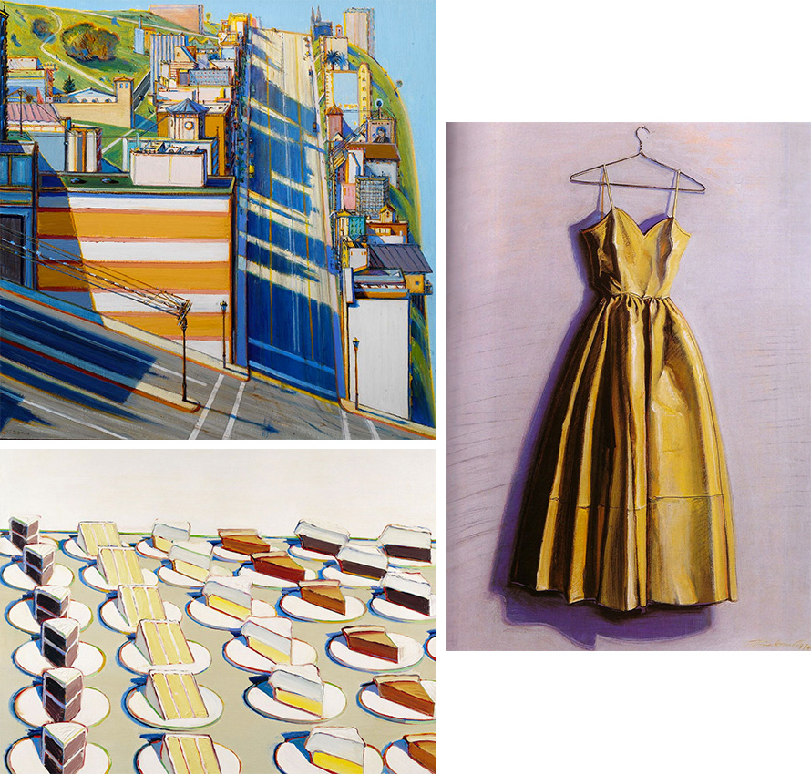
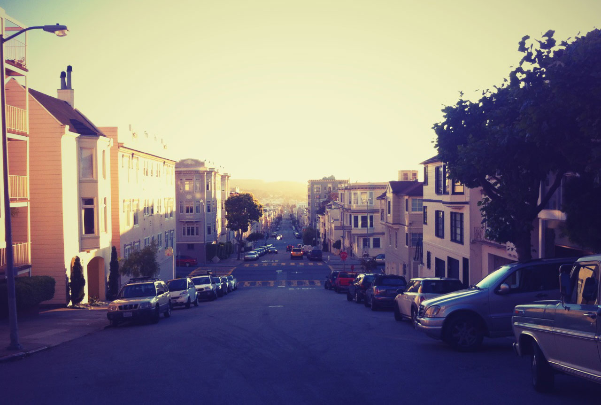
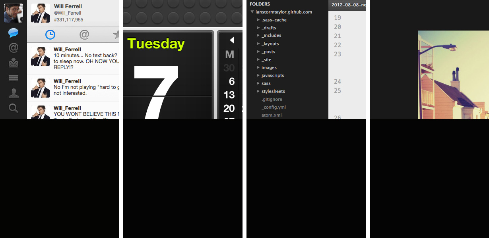
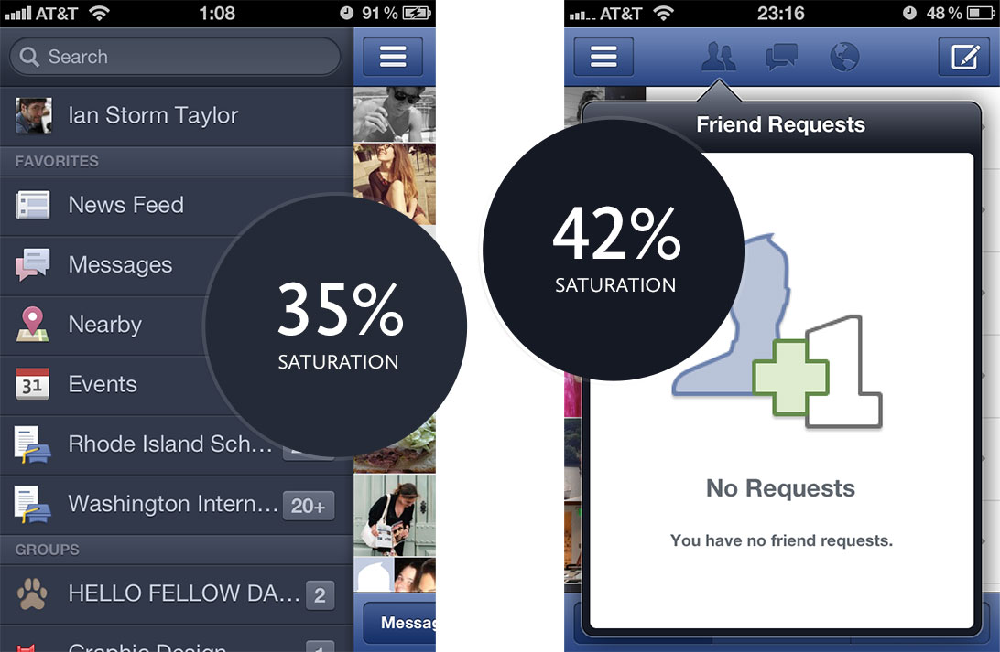

# Design Tip: Never Use Black

One of the most important color tricks I've ever learned was to avoid using the color black in my work. Mrs. Zamula, my childhood art teacher, first warned me about black when I was in middle school. And I heard the same again multiple times at RISD. It sounds weird at first, but it's good advice.

Problem is, we see **dark** things and assume they are **black** things. When, in reality, it's very hard to find something that is pure black. Roads aren't black. Your office chair isn't black. The sidebar in Sparrow isn't black. Words on web pages aren't black.

## Shadows aren't black.

In high school, I spent lots of my free time in the art room with a few other art-loving friends. (It was either that or playing Halo, which I did a lot of too.) Mrs. Zamula was constantly showing us different artists' work. One book she would always bring back out to leaf through was of [Wayne Thiebaud's](http://en.wikipedia.org/wiki/Wayne_Thiebaud) work. She would excitedly point out the slivers of bright primary color he slips between shadows. And she'd tell us to look at his bright blue shadows!

I probably went through that book ten times. Thiebaud is a perfect example of shadows not being black. (And he's a painter that anyone living in San Francisco should know.)

His shadows are some of the most saturated parts of his paintings, and that's on the screen too. On paper they'd look even nicer. And in real-life nicer still.

Now you might be thinking, "Yeah, but those are paintings. They're not real." Well, how real do you think our interfaces are to Thiebaud?

But I must have been thinking the same thing, because one of those days in art class Mrs. Zamula came in with a blue light bulb to prove it. She screwed the bulb into a clamp-light, plugged the light in and clamped it to a stool. Then she got a pure-white ball from her cabinet full of pure-white things (that she kept for figure drawing exercises) and placed it on a pure-white pedestal, under the light. And sure enough, when she turned on the blue light, the shadow cast by the ball was an orange tint, not black.

I was amazed. And now when I walk down the street in San Francisco I love looking for the most saturated shadow I can find. Here's a photo I took down the street with Path (yes, filters...) that reminded me of Thiebaud in the first place:

<small>The corner of Chestnut and Polk.</small>

The darkest part of that image? It's not `#000000`. It's `#130f30`. (That's 19% brightness and 69% saturation!)

## Black overpowers everything else.

When you put pure black next to a set of meticulously picked colors, the black overpowers everything else. It stands out because it's not natural. All of the "black" everyday objects around you have some amount of light bouncing off of them, which means they aren't black, they're dark gray. And that light probably has a tint to it, so they're not even dark gray, they're colored-dark gray.

Lots of the apps we use on a daily basis have blacks that aren't really blacks, but dark grays. Twitter's sidebar, [Sublime Text 2](http://www.sublimetext.com/2)'s sidebar if you have [Soda Dark](https://github.com/buymeasoda/soda-theme/) installed (which you should!), new Photoshop's background,  the calendar widget. Even Twitter Bootstrap. They all use colors close to black, but slightly muted so they don't overpower the rest of the elements on the screen.

Here's a bit of a contrived example... Dribbble has a pretty awesome feature that lets you search for shots by color. If you search for [shots with pure black](http://dribbble.com/colors/000000?percent=25&variance=0) and [shots with "real black"](http://dribbble.com/colors/292724?percent=25&variance=15) which ones feel better? Not the ones with pure black in them.

It's not only about the brightness (or value) of the color either...

## Saturation is just as important.

You can do even better than staying away from pure `#000000` black too. Whenever you're working with grays, add a bit of color to them and they will feel less dull. The amount of color you can add is proportional to how dark the color is. The black from my Path photo had 69%! saturation, whereas a light-gray might only need 3%.

I've used that as a general guide when making the color palette for [Segment](https://segment.io). I mix a small amount of yellow-orange into our grays. Saturation starts at 2% for our lightest gray and steadily increases until it's at 22% for the darkest gray, forming an arc across the Photoshop color picker.

But don't take my word for it again—let's look at Facebook. Why does the Facebook Mobile interface feel so nice? Because all of those grays are pumped full of Facebook Blue.

## It's been a long time coming.

Mrs. Zamula first warned me about black back in middle school, and others warned me later on, but it's still taken me a long time to really grok, and to build up the automatic response against it. Even now, I still have trouble choosing grays that set the right mood.

Bottom line is: when you find `#000000` in your color picker, ask yourself if you really want pure black. You're probably better off with something more natural. And if you're feeling adventurous, try staying away from the left edge of the color picker altogether.