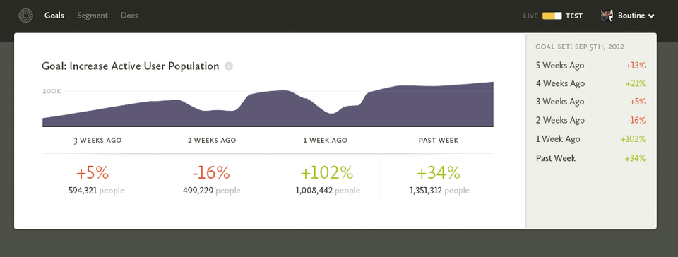

# Walking Through the Design Process

I was rummaging through my drafts folder and stumbled on this old post walking through the process of designing the "Goals" feature on our old product, before we switched to what [Segment](https://segment.com) is now. I think it's an interesting look into how a mockup progresses in Photoshop, so here it is:

---

We were all really excited about [PG's growth essay](http://paulgraham.com/growth.html). It's one of those things that makes so much sense after he lays it out, but had never been so concretely defined before. After reading that essay, I knew that I wanted to make it possible for our users to track their active user growth rate exactly like PG was suggesting.

We've known for a while that goals of some sort would be an awesome thing for Segment to make available. Being able set goals and see your progress over time would be sick. But PG's essay gave us a really, really compelling goal that applied to every company. Which meant it could be the default—the blank state.

Shortly after PG's essay was published, I came across [David Stefanide's shot on dribbble](http://dribbble.com/shots/714266-Dashboard). When I saw that shot, I knew that was how we should be visualizing goals.

With PG's essay and David's shot I had the spark I needed to take a crack at designing the goals dashboard that weekend. I'll take you through how the designing progressed:

This is the very first save on the file. 

Nothing is working yet, and I haven't done anything to the graph (I copied it in from another mockup), but the ideas are forming. For a weekly goal, I imagine showing the past month of progress, and the sidebar will show a history going further back.

Ideally the red/green percentages combined with the sidebar history will be enough of a grab that our users really won't want to miss a goal each week. It's the old red X's on a calendar approach.

I turned the graph into a "goal graph", borrowing from David's shot. And I'm trying to wrangle the sidebar into something not so hideous.

I've also realized that for goals (unlike other parts of our interface) people will want to see absolute dates. You don't want your progress buckets shifting depending on what day it is. If last week you had +102% growth, you want it to stay that way, so the date buckets need to be absolute.

Boom, purple sidebar. The tan was too boring.

I also realized that the goal line needed to re-adjust itself each week. Because if someone misses their goal a few too many times they're just going to end up with a ridiculous goal that will only serve to frustrate them. So now the goal is based on the end value of the previous week.

The title also changed. I envision these goals being created by looking at other graphs on Segment, after you've chosen a particular segment. So the new title treatment is me trying to remind you of the segment you chose originally.

I showed the mockup to [Ilya](http://ivolo.me) for an early round of feedback, and he said he wants checkmarks. Makes sense, they feel good. We want our users to feel accomplished if they meet their goal each week. 

Checkmarks and crosses! Now I'm just trying to unify the checks and crosses in the table and in the sidebar.

Those checks and crosses feel better.

I also realized it would probably be annoying to create a brand new goal and immediately see the past weeks not meeting the goal, so I came up with a divider to show when the goal was set. That way you get the benefit of retroactive goals, without the psychological downside.

Even more unified check and crosses!

The sidebar was feeling pretty cramped too, so I gave it a bit more room. And I added a title to be consistent with the other places we uses sidebars on Segment.

The graph also got simpler (more confusing? :p). Generally, as I work on an interface I see ways to remove and combine elements, so that's what's going on there. I also realized that this box is for a single goal, and I'd like to be able to show at least 3 before the fold, so everything needs to get more compact.

Nothing big. Made the sidebar title simpler. Added a gray checkmark to show that this week you're on track to be successful. 

Ilya and [Calvin](http://calv.info) told me they didn't understand why the "+34%" was gray (it's because the week isn't over yet!), so I'm trying to figure out how to make that more obvious.

This was a pretty big visual breakthrough. 

I realized there wasn't really a reason to have that much white space around everything. Removing it all made the box much more compact. And since the history will scroll, there's no loss there.

I also realized that I could change the current weeks dates to "This Week" and that should make it more obvious why "+34%" is in gray still.

That purple was feeling too playful in an immature way. And it was clashing with the red and green a little too much. The red crosses still clash a little bit, but I figure that's their fault for not meeting their goal. (Maybe it even makes it feel worse to miss a goal? Who knows...)

Also I removed the line around the "Goal set" marker. It wasn't really necessary and it was just adding extra visual noise.

At this point, I sent an email out to [Peter](http://rein.pk) (he was off getting ready to get married!) and he tore apart my graph, making a couple really good points:

1. It's confusing as hell.
2. Even if you meet your goal for the week, there's still a bunch of red on the graph. In fact, there's just always going to be way more red than green on the graph.
3. The goal line is sooo hard to see.
4. If it's a weekly goal, he doesn't want to see daily fluctuations in the goal because it confuses him more.

It took me a little to let Peter's feedback sink in, but all his points are pretty valid. I came up with two different directions:

Changing the goal line was a no-brainer. That was just a case of me trying to simplify too much. The bigger question was whether to go with a daily graph or a weekly graph.

Problem is, there were still a few things I liked about the daily graph:

1. It gets around the big problem of showing the current value. With the daily graph, you can see your progress each day towards your goal. As long as you're growing enough each day, you can stay above the blue goal line. With the weekly graph, you're guaranteed to be below the line for a majority of the week unless you do exceptional well. I though that that might be demoralizing or annoying for our users.

2. It also matches the graph that a user would have originally seen before setting their goal. We show daily area plots in the Segment page, so it makes sense to carry that over to the Goal page as well so that the user can make the connection. These are the kinds of total-experience factors you have to weigh when making decisions in different parts of an app.

I asked Ilya, Calvin, Peter and Erika (Peter's wife!) and they all agreed weeks was better. Makes sense.

From Erika's feedback, I also made a couple more changes. She suggested using "So far this week" as the text, which is way more obvious even, so that's awesome. She also thought that the "Goal set..." in the sidebar was a header, so I gave it the same text treatment as the other list items.

Erika also asked about editing goals, which I had thought through, but hadn't added the mechanisms for doing it to the mockup... doh! So that's where the Edit and Segment buttons come in. Edit lets you change the goal, probably adding an entry to the history noting the change. That way you get to keep your old history untouched. And Segment takes you to the original graph that the goal was set from.

Peter suggested I add "Goal:" in from of the graph's subtitle. And I shifted it to match the color of the line on the graph.

Oh and I also got rid of the red/green line changing mid data point. I figured it was just going to be annoying to implement in SVG, and it wasn't really adding enough to justify it.

---

That's where my old post stopped. I have no idea what more I was thinking back then, and we never shipped the feature before pivoting. It's funny how bad all of these designs look only five months later, and all the pieces I'd change if I were to design it again.

For example, we have our own internal goal graph at Segment and we've done away with the goal line completely. Why use a line when what you really want is a dot—a fixed point in time.

We've also ditched the idea of a sidebar. It's just visual clutter, just make the graph wider and have it summarize the entire timespan you care about right now. If you really want to go super far back, add a calendar.

I have yet to see anyone do a good "Goal" graph in analytics too, which is too bad because that's one of the most important parts of tracking your One Key Metric.

Anyways, hope you enjoyed the process.

PS. The tool I used to document my entire process is called [LayerVault](https://layervault.com). If you haven't heard of it, check it out. It's an awesome way to document your process without having to remember to save all the time.