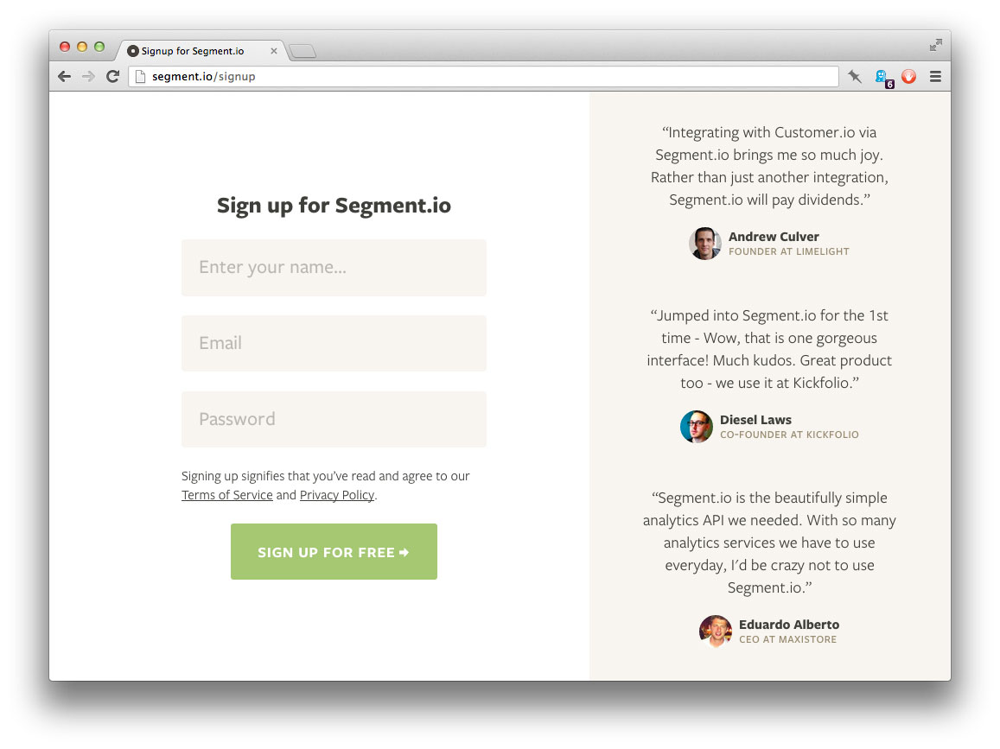
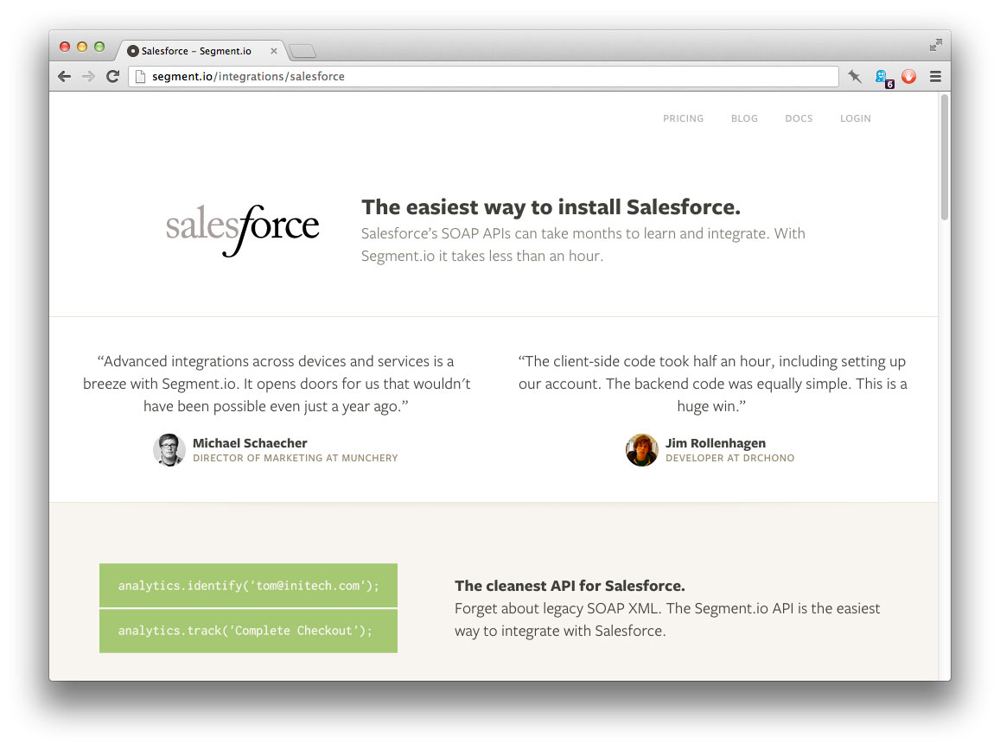

# Media Queries are a Hack

The big buzzwords in CSS these days are "modular" and "responsive"—and for good reasons. But we're still trying to achieve those goals with the wrong tool: Media Queries. What we actually need is a tool that doesn't exist yet: Element Queries.

This is without a doubt the _biggest_ problem I run into while working on Segment. I want to write [modular components](http://tjholowaychuk.com/post/27984551477/components) that I can re-use all over our site, and even across sites—little pieces of CSS, HTML and Javascript that get packaged together once, and don't need to be tweaked everytime they get used. But CSS as it currently stands won't let me.

I want **write-once**, **use-anywhere**—that's what modular code is.

Media queries are not that. **They're write-everywhere.** They're relative to your screen, so every time you write a media query for `max-width` or `min-width`, you're connecting the appearance of your module to the width of the entire canvas—exactly what you were trying to avoid. 

Change the number of columns in your layout? Update all of your media queries... Change one of your breakpoint widths? Update all of your media queries...

That's not maintainable.


## Here's a real-world example...

I was working on testimonials for our [new pricing](https://segment.io/pricing) page last week, so the example is fresh in my mind. We went around and collected a bunch of nice things our users have said about us, and stored them in JSON files so we can put them up around the site.

Depending on where we show them, the width and height of their parent element will vary. On the **Signup** page they're in a column down the right-hand side of the page: 



On the **Pricing** page we put two testimonials side by side instead:



That's the same `.testimonial` module in both places, but their context differs. 

Now say I want to make them responsive. After a certain breakpoint where the testimonials gets squeezed too much, I want to shrink the avatar and font-size slightly and hide the company information.

The key here is that I'm not only talking about narrow screens. I'm also talking about narrow columns on large screens.

Doing this today, I have to resort to Media Queries, which immediately breaks my modularity. On the **Pricing** page, I need a breakpoint at around `34em`. But on the **Signup** page, those same styles need to kick in at around `47em`.

Now I'm stuck with the same pieces of code in two different page's styles (or two unrelated pages styled in the same place). It's not modular no matter how you slice it. And it gets worse! I want to add more testimonials to our Home page. And [Ilya](http://ivolo.me) wants to add a "Happy Customers" page full of testimonials as well.

I'm going to end up with an unmanageable mess, when all I really needed was the ability to say, "when a `.testimonial` element gets too narrow, rearrange things a bit". I should be able to do that regardless of the browser's width, so that they'll look good no matter where I use them.


## We've been doing it wrong this whole time.

Writing modular code is about making small objects, and making them self-contained. Media queries don't let you do that. In _most_ cases, you don't actually care about the width of the entire document (or screen), you care about the width of your element.

If a `.testimonial` element only has `500px` of room on the page, I don't care if the document is actually `2100px` wide, I want the styles to reflect that 500 pixels that I have to work with. My styles shouldn't be:

```css
@media (max-width: 2100px) {
  .testimonial {
    font-size: 0.8em;
  }
}
```

That's the kind of hack we've been using just to get by. That's not what we actually want to be doing. We want this:

```css
.testimonial (max-width: 27em) {
  font-size: 0.8em;
}
```

That's modular.


## Brittle examples are all around you.

One of the reasons I think this need hasn't been solved yet is because it's easy to _think_ that media queries solve all of our problems at first.

One of the textbook media query examples is a super-simple blog. Problem is, a blog post's width is highly-correlated to the window's width, so it makes Media Queries seem like a better solution than it is. My testimonials aren't highly-correlated to the windows width.

But even some of the more intricate examples are better-solved by Element Queries:

[This early post about media queries](http://css-tricks.com/css-media-queries/) by Chris Coyier is a perfect example of when Element Queries should be used instead. In his example, Chris adds icons to a list of links if he has enough room. But if that email template changes at all, those perfectly-tuned media queries will break. The list of emails should be styled relative to its _own_ width, not the entire email's.

The same goes for lots of the examples in Brad Frost's awesome [repository of Responsive Patterns](http://bradfrost.github.com/this-is-responsive/patterns.html). The styles applied to [this list](http://codepen.io/bradfrost/full/ykalp) and [this grid](http://codepen.io/bradfrost/pen/xkcBn) will break if you decide you only want them to take up half of the screen, instead of the full width that media queries assume. When you're styling [this table](http://css-tricks.com/examples/ResponsiveTables/responsive.php) you don't really care about the browser's width, you care about how much space your table has for columns.

Tim Brown's [Molten leading](http://nicewebtype.com/notes/2012/02/03/molten-leading-or-fluid-line-height/) would also be solved by element queries. Instead of needing a truly fluid line-height property, you'd just have several breakpoints for your given element. Each individual element can control it's own type; the larger the element in `em`s, the larger your line-height.

I'm not hating on these examples—these guys are awesome and have been influential in me ever understanding media queries in the first place. They're working with what we've got, but we can improve our tools.


## So... is this ever going to be possible?

A while back [Paul Irish mentioned](https://twitter.com/paul_irish/status/161664213054533633) that "element queries" had been brought up before, but it's been incredibly hard to find any real discussions about them. Luckily others seem to be [coming around](https://twitter.com/necolas/status/299573744307941376) to the idea too. 

Jonathan Neal recently [wrote up his thoughts](http://www.jonathantneal.com/blog/thoughts-on-media-queries-for-elements/) on what the syntax should look like, and has his own [proof of concept](https://github.com/jonathantneal/MediaClass). I'm not a big fan of using the `media` keyword, because it doesn't make semantic sense once you're no longer referring to the global canvas, but it's a good start nonetheless.

I'm sure there are tons of problems to work out to make `@element` queries possible; I'm not a spec writer or implementor. But I really hope more people start rallying behind Element Queries and they get implemented because they're really critical to our ability to write truly modular CSS.

Until then we're stuck with hacky media query or Javascript solutions.

<small>
  PS. For a little look into the kinds of problems that need to get dealt with, take a look at my testimonial example again. I'm changing the font-size on a font-size-relative breakpoint. Mindfuck.
</small>


