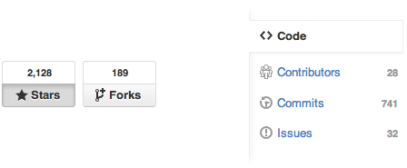
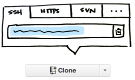
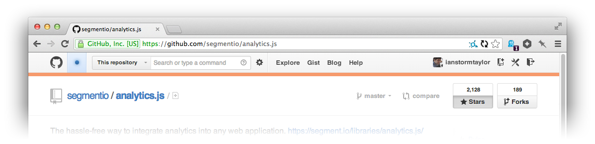
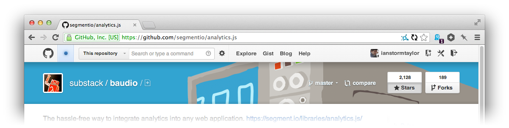
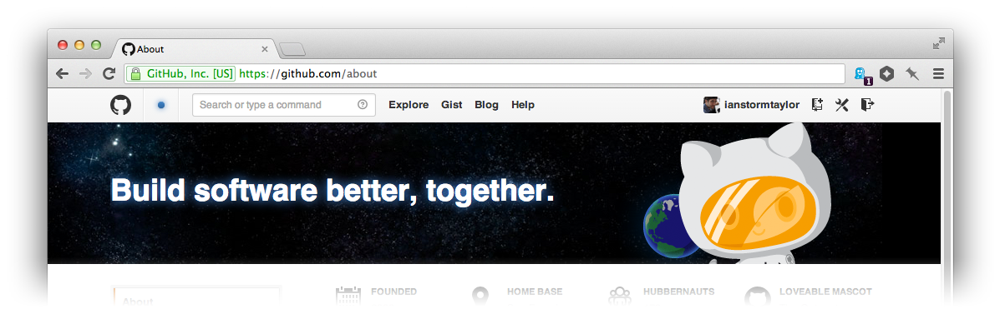

# Refactoring GitHub's Design

Reducing an interface until only the _absolutely_ necessary elements remain is one of the most satisfying tasks in design. 

First you notice duplication between two elements. Then you derive a new visual abstraction that handles both cases. And finally you combine the elements into a single, simpler version. Those skills are critical for a visual designer to master.

It's the same satisfying feeling you get when refactoring code. I'm serious! If we change the "code" references, you'd assume Mr. Kerievsky was talking about "an interface" all along:

> By continuously improving the design of \[an interface\], we make it easier and easier to work with. This is in sharp contrast to what typically happens: little refactoring and a great deal of attention paid to expediently adding new features. If you get into the hygienic habit of refactoring continuously, you'll find that it is easier to extend and maintain \[an interface\].
> <small>Joshua Kerievsky, [_Refactoring to Patterns_](http://www.amazon.com/Refactoring-Patterns-Joshua-Kerievsky/dp/0321213351?tag=electronicfro-20).</small>

GitHub's newest redesign is a perfect example of visual refactoring. The old interface, while very useful, was getting more and more cluttered as new features were added over the years.

The new design still has all of the features of the old one—the external API if you will—but it's been completely reorganized to emphasize the commonly used features.

GitHub did a lot of things right; they could have taken a few things farther; and then, as always with a redesign, they did a few things wrong. When you're refactoring a design there are a few things you want to watch out for...

## Doing the same thing in lots of different ways.

The old GitHub interface had **four** different ways to show an integer next to a label:

That's a lot of different ways to visualize the same idea. All of those different treatments make the page feel more cluttered. Unless you have a good reason for making visual elements slightly-different from one another, you should default to keeping things consistent.

GitHub's new design reduced it to **three** different ways, but I think it can be reduced even further, to the following **two**:

**Stars** and **forks** are pretty core to the way we perceive repositories on GitHub, so I didn't want to mess with those much. And the issue and pull request counts are very useful where they are, so those stay too. But the [branches and tags counts](/posts/refactoring-githubs-design/images/language.png) seem like they were added just because they _could_ be. I've never once cared about the number of branches or tags a repo has.

By moving all of the counts into the sidebar navigation we get a few nice wins:

- Now we only have **two** ways to display counts.

- We no longer need to add noise to the page with counts for branches and tags. In fact, we can go further and even combine those into the same navigation tab.

- We can give more prominence to the **Contributors** count by putting it right underneath **Code**. I think GitHub should emphasize contributors more because it's powerful. Not only would it make repositories feel more like a community, but my guess is it would also encourage pull requests to get on the list.

Inconsistency isn't limited to appearance either. I often end up with a design with duplicate content that could be combined if I just came up with a better abstraction. A good example of this is the repo's name and file path:

There's no reason we can't combine the two instances of "analytics.js" into a single path. And then, since we're working in an interactive medium, we can do things like shrink the font-size for long file paths.

And at the same time, we can de-emphasize the branch switcher since it's so rarely used. Which brings me too...

## Rarely-used features squatting on prime real estate.

When you're designing an interface you're always going to have a spread of feature usage. There are the features that _everyone_ uses on a daily basis, and there are the ones that only the advanced users even _know_ about. Your job as a designer is to balance them all.

One of the quickest ways for an interface to become cluttered is for rarely-used actions to be granted prominent screen real estate.

The **Clone in Mac** button was a perfect example of an under-used feature taking up valuable screen real estate. The average user rarely, if ever, needs to click that button. But for some reason it used to be one of the first elements on the page, right underneath the description of the repository!

I say "for some reason", but the reason's actually obvious: GitHub needed a place to put that button, and the toolbar was _right there_! Adding an extra button was trivial. But that's why an interface needs to be refactored every so often, just like a codebase. Quick fixes are great in the heat of the moment, but over time you build up debt that reduces the quality of your product.

GitHub's new design eliminates a lot of that debt and puts the emphasis on repository content instead. Less-used features have been hidden or moved further down the page.

Speaking of which, lets take a look at the entire old clone URL input:

Cloning a repository happens rarely, but in the old interface it was one of the first things on the page. Not only that, but the Bootstrap-style buttons each demand lots of attention. 

Using Bootstrap-style buttons for every action in your interface, while convenient, is a huge anti-pattern. They're great for primary actions that are used often, but use them for a few too many secondary actions and your interface will start to look like a jumbled mess.

In the new design, GitHub has drastically reduced the cloning feature's prominence, but I think they could take it ever further.

Interface design has a huge leg up over print design because you can easily hide advanced features until exactly when they are needed. That way they don't get in the way of the 90% use case. We can apply that kind of thinking to the clone URL, and make it even simpler:

At first glance it might seem like we just lost a ton of functionality, but that's the beauty of interactive interfaces; we didn't. Clicking on that clone button can open a small popover with the familiar URL input:

And better still, that input can autofocus itself!  When compared to my current workflow for cloning of **double-click to select + cmd-c**, using a popover with autofocus would actually be **single-click + cmd-c**.

Simple changes like that can drastically reduce the noise on the page. Which another thing to watch out for...

## Excessive visual noise.

The new language bar is one of the most contentious pieces of GitHub's new design. And for good reason.

Putting the bright red language bar between the header and content of the repo page makes the page significantly harder to parse. Your eye wants to move between two key pieces of information: the identity of the repo at the top, including the header, description, star counts, and the content of the repo at the bottom: the code and Readme.

GitHub should take a leaf out of Facebook.

Regardless of your opinion of Facebook, their decision to move from a single profile picture to the combination of a square profile picture and landscape cover photo was genius.  Combined, the two photos are _very_ successful at summarizing an "identity" of a user. Twitter, Medium and Google Plus have all borrowed the concept as well, because it works.

I think the same abstraction could be applied to repositories.

Instead of the jarring colored language bar that impedes the path to the code and Readme, the repository's identity can live above it's header:

The makes it easier for your eyes to scan straight to the repository content, instead of getting distracted half-way through their journey.

Or imagine letting repository owner choose their own images:

Conveniently, it matches the design direction that GitHub has been implementing on the other pages of their site, namely [Enterprise](https://enterprise.github.com/) and [About](https://github.com/about), where there is an image on a layer beneath the white of the page. (They could even parallax the background if they wanted to get fun!)

## After refactoring you get to do more.

If you looked at GitHub's old interface, and suggested adding a user-chosen image to the background, everyone would have said, "hell no!", and rightly so. Even with the potential gains it would have been _way_ too distracting to be worth the costs.

But after refactoring the interface, that feature no longer feels like such a long shot. There are still a few problems with it, but they could easily be resolved by resourceful designers and programmers, which GitHub has lots of.

Here's what I eventually ended up with. There were tons of little optimizations I made along the way. You can check out the entire timeline of the file I worked in [on LayerVault](https://layervault.com/ian-storm-taylor/Experiments/github.com/new-github.psd/1).

That's the beauty of refactoring an interface: after you clean up all of your informational and visual debt, you have so much more room to imagine new futures for your product. I for one am extremely excited by GitHub's newest refactoring, and I can't wait to see what they do with it next.

<small>
PS. If anyone from GitHub reads this, please, please tell me that you guys are working on a Google Groups killer. Every day I wish **Issues** had a discussions component, because I really want to debate process and syntax and everything else with the other [Component](https://github.com/component/component) folks.
</small>